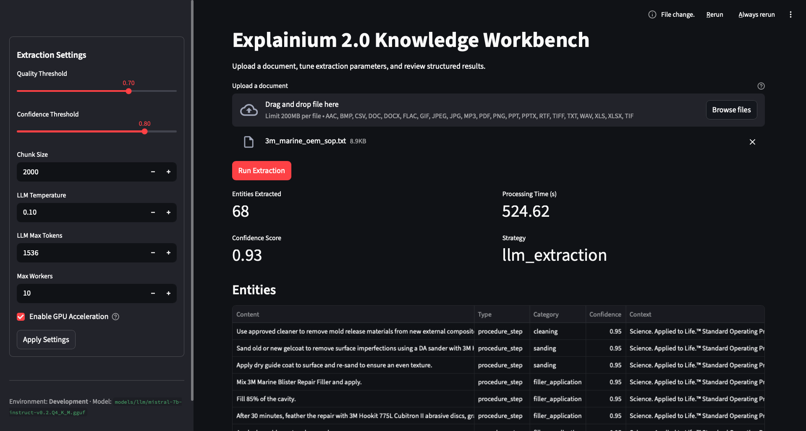

# Explainium - Intelligent Document Knowledge Extraction

Explainium converts unstructured technical, safety, compliance and operational documents into structured, validated knowledge. Runs fully locally with offline AI models and produces database-ready entities with confidence scoring.

[](https://python.org)
[](https://fastapi.tiangolo.com)
[](https://github.com)

## Overview

**Explainium** transforms complex documents into structured knowledge using a modern, streamlined architecture:

- **LLM-Only Engine**: Mistral-7B (via llama.cpp) powers every extraction step
- **Async Processing**: High-performance document handling with concurrent operations
- **Document Coverage**: PDF, DOCX, TXT plus OCR for common images and Whisper-backed audio transcription
- **Quality Assurance**: Confidence scoring with configurable quality thresholds
- **Operational Readiness**: Environment-based configuration with health monitoring

## Architecture

### Current Clean Structure
```
src/
├── ai/
│   └── unified_knowledge_engine.py    # AI engine
├── api/
│   └── app.py                         # FastAPI application
├── core/
│   └── unified_config.py              # Environment-based configuration
├── processors/
│   └── streamlined_processor.py       # Async document processing
├── middleware.py                      # Request logging & tracking
├── logging_config.py                  # Structured logging
└── exceptions.py                      # Custom exceptions
```

### Extraction Flow
1. **Content Extraction**: Format-specific loaders turn PDFs, Office docs, spreadsheets, images, and audio into text
2. **LLM Analysis**: The Mistral-7B model generates structured entities from extracted text
3. **Validation & Scoring**: Results are filtered using configurable confidence thresholds

### Confidence Scoring
- Every extracted entity carries the `confidence` value returned by the LLM (expressed between 0 and 1).
- If the LLM omits a confidence, the parser substitutes the configured default (0.8 by default from `CONFIDENCE_THRESHOLD`).
- The response-level `confidence_score` is the simple average of all entity confidences collected during extraction.
- Downstream services can adjust acceptance criteria by comparing the aggregate score with their desired threshold.

## Quick Start

### Installation
```bash
git clone https://github.com/imaddde867/explainium-2.0.git
cd explainium-2.0
pip install -r requirements.txt
python -m spacy download en_core_web_sm
```

### Launch Streamlit
```bash
streamlit run streamlit_app.py
```



### Access Points
- **API Server**: http://localhost:8000
- **Interactive Docs**: http://localhost:8000/docs
- **Health Check**: http://localhost:8000/health
- **System Config**: http://localhost:8000/config
- **Sample Inputs**: `documents_samples/` and `test_sample.txt` (optional, for manual experiments only)

### Basic Usage
```python
import requests

# Upload and process document
files = {"file": open("document.pdf", "rb")}
response = requests.post("http://localhost:8000/extract", files=files)

result = response.json()
print(f"Extracted {len(result['entities'])} entities")
print(f"Confidence: {result['confidence_score']:.2f}")
```

## API Endpoints

| Endpoint | Method | Description |
|----------|--------|-------------|
| `/` | GET | Welcome message and system info |
| `/health` | GET | System health status |
| `/config` | GET | System configuration and GPU status |
| `/extract` | POST | Process document and extract knowledge |
| `/docs` | GET | Interactive API documentation |

### Extract Endpoint Example
```bash
curl -X POST "http://localhost:8000/extract" \
  -H "Content-Type: multipart/form-data" \
  -F "file=@document.pdf"
```

**Response:**
```json
{
  "document_id": "8f1cba23b4d1e5ab",
  "document_type": "manual",
  "entities": [
    {
      "content": "Safety inspection protocol",
      "entity_type": "procedure",
      "category": "process",
      "confidence": 0.92,
      "context": "Page 3 paragraph discussing inspection cadence..."
    }
  ],
  "confidence_score": 0.87,
  "processing_time": 2.34,
  "strategy_used": "llm_default",
  "metadata": {
    "file_format": ".pdf",
    "file_name": "document.pdf",
    "entities_extracted": 1
  }
}
```

## Configuration

### GPU Acceleration (Recommended)
Explainium uses GPU-accelerated LLMs by default for optimal performance:

```bash
# GPU Configuration (Auto-detected by default)
export ENABLE_GPU=true
export GPU_BACKEND=auto  # auto, metal (Apple Silicon), cuda (NVIDIA), cpu
export LLM_GPU_LAYERS=-1  # -1 = all GPU layers, 0 = CPU only
export GPU_MEMORY_FRACTION=0.8  # Use 80% of available GPU memory
```

**Supported Hardware:**
- **Apple Silicon** (M1/M2/M3/M4): Metal backend (auto-detected)
- **NVIDIA GPUs**: CUDA backend (auto-detected)  
- **CPU Fallback**: Automatic fallback if GPU unavailable

### Environment Variables
```bash
# Core Settings
export EXPLAINIUM_ENV=production
export EXPLAINIUM_LOG_LEVEL=INFO
export MAX_FILE_SIZE_MB=50

# Quality Thresholds
export CONFIDENCE_THRESHOLD=0.8
export QUALITY_THRESHOLD=0.7

```

### Supported Formats
- **Documents**: PDF, DOC, DOCX, TXT, RTF
- **Images**: PNG, JPG, JPEG, GIF, BMP, TIFF (OCR required)
- **Spreadsheets**: CSV, XLS, XLSX
- **Presentations**: PPT, PPTX
- **Audio**: WAV, MP3, FLAC, AAC (Whisper transcription)

## Knowledge Categories

| Category | Description | Target Confidence |
|----------|-------------|-------------------|
| **Technical Specifications** | Parameters, measurements, equipment specs | 0.95 |
| **Risk & Safety** | Hazards, safety measures, PPE requirements | 0.90 |
| **Process Intelligence** | Workflows, procedures, step-by-step guides | 0.85 |
| **Compliance** | Regulations, standards, requirements | 0.80 |
| **Organizational** | Roles, responsibilities, personnel info | 0.75 |
| **Definitions** | Terms, explanations, knowledge base | 0.70 |

## Development

### Local Development
```bash
# Install in development mode
pip install -e .

# Run tests
pytest

# Check code quality
python -c "from src.ai.unified_knowledge_engine import UnifiedKnowledgeEngine; print('Engine OK')"
```

### Model Management
The system automatically downloads required models on first use:
- **Whisper**: Speech-to-text (audio processing)
- **BGE Embeddings**: Semantic similarity 
- **spaCy**: NLP processing
- **Mistral-7B**: Large language model 

## System Requirements

### Recommended  
- **Python**: 3.12+
- **RAM**: 8GB+
- **GPU**: Metal/CUDA acceleration

## To experiment with 

- Drop chunk_size from 2000 to 512–1024 so small files don’t produce fat context blocks. Fewer characters means less to reason about and fewer tokens in the reply.
- Consider zero temperature (llm_temperature = 0.0) or add a stronger system prompt ending in “Respond with ONLY a JSON array.” That reduces chatter and makes the parser happier.
- If you we to keep the friendly prompt, catch JSONDecodeError and fall back to a JSON repair step (e.g., use llama_cpp’sstructured_output or run the response back through json.loads after trimming to the last ]).
