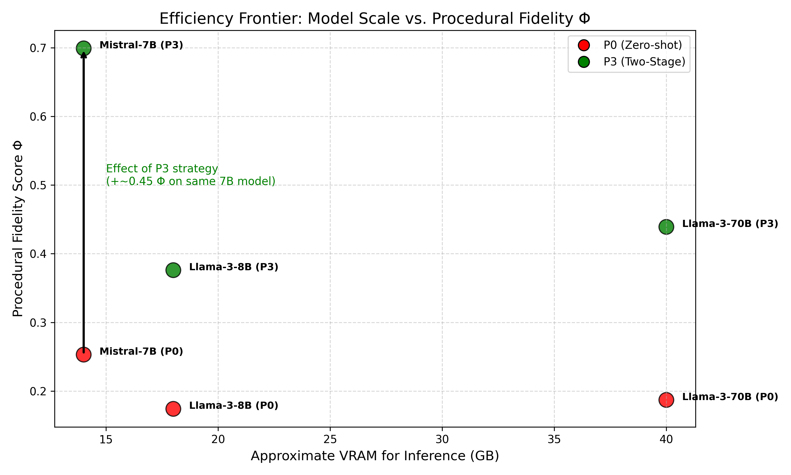

# IPKE — Industrial Procedural Knowledge Extraction

Thesis-grade, privacy-preserving pipeline that reconstructs Procedural Knowledge Graphs (PKG) from safety-critical industrial manuals for human-in-the-loop validation and decision-support integration (Thesis Abstract).

## Validated Impact

- **Local privacy preservation** — IPKE processes sensitive SOPs entirely on-prem via quantised 7B models, avoiding external APIs while maintaining schema fidelity (Thesis Abstract, §6.6).
- **Two-Stage Decomposition (P3)** — P3 delivers Step F1 = 0.377 and Φ = 0.611 across Tier-A documents (Table 10) and Φ = 0.699 with 75% constraint coverage on the 3M SOP, outperforming Llama-3.1-70B zero-shot (Φ = 0.187, 0% coverage) and even its own P3 setup (Φ = 0.439, 50% coverage) (Table 12).
- **Constraint-focused PKGs** — Constraint coverage rises from ≈0% under baseline prompting to 0.708 with P3 (Table 10), yielding queryable PKGs where GUARD edges bind safety rules to each procedural step (Fig. 11).



## Method Kernel

- **Dual Semantic Chunking (DSC)** aligns document headings with embedding-based cohesion to limit context fragmentation for mid-sized models (Thesis §4.1).
- **P3 — Two-Stage Decomposition** decouples ordered step extraction from constraint attachment, eliminating schema drift seen in zero-shot and chain-of-thought baselines (Thesis §4.2–5.4).

## Run IPKE

```bash
python3 -m venv .venv && source .venv/bin/activate
pip install -r requirements.txt
streamlit run streamlit_app.py
```

```ini
# .env
GPU_BACKEND=metal
CHUNKING_METHOD=dual_semantic
PROMPTING_STRATEGY=P3
# Deduplicate overlapping content and enforce clean constraints/steps
ENABLE_CHUNK_DEDUP=true
```

```bash
# Reproduce chunking experiments
python scripts/experiments/run_all_chunking_experiments.py \
  --documents datasets/archive/test_data/text/*.txt

# API surface
python main.py  # http://localhost:8000/docs
```

Research distribution for academic and regulated industrial settings. See `LICENSE`.

---

Turku University of Applied Sciences · 2025
