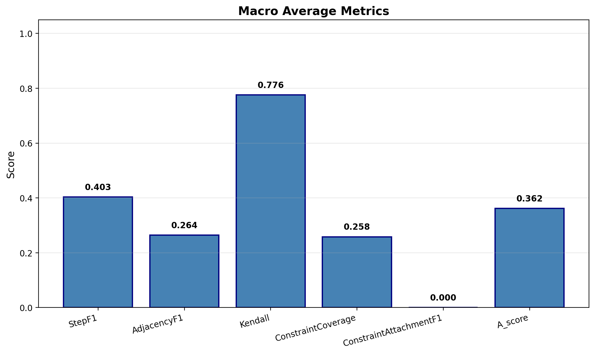
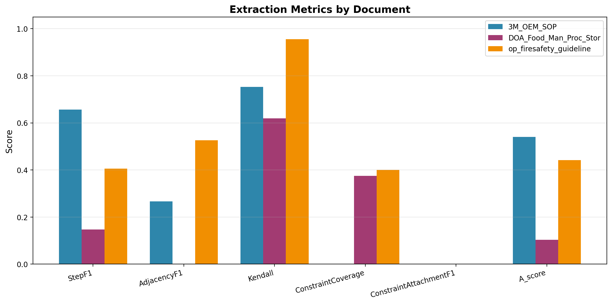
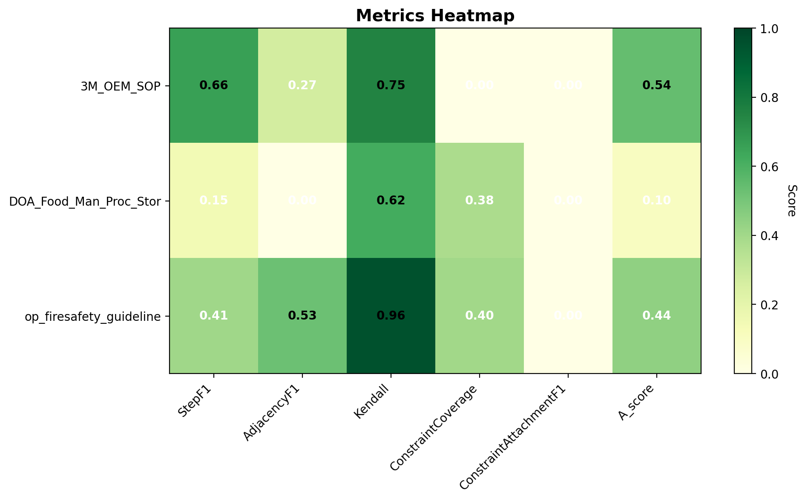

# Extraction and Evaluation Summary

**Generated:** 2025-11-08 10:15:33

**Results Directory:** `logs/single_run`

---

## Configuration

```
LLM Max Chunks:          0 (unlimited)
LLM Context Size:        8192
LLM Max Tokens:          1536
GPU Enabled:             True
GPU Layers:              -1 (all on GPU)
Quality Threshold:       0.7
Confidence Threshold:    0.8
```

## Overall Performance (Macro Average)

| Metric | Score |
|--------|-------|
| A_score | 0.362 |
| AdjacencyF1 | 0.264 |
| ConstraintAttachmentF1 | 0.000 |
| ConstraintCoverage | 0.258 |
| Kendall | 0.776 |
| StepF1 | 0.403 |

## Key Findings

### Strengths 💪

- **Kendall**: 0.776 (Strong)

### Areas for Improvement 🎯

- **AdjacencyF1**: 0.264 (Needs improvement)
- **ConstraintCoverage**: 0.258 (Needs improvement)
- **ConstraintAttachmentF1**: 0.000 (Needs improvement)

## Document-Level Results

### 3M_OEM_SOP

**Extraction Summary:**
- Steps extracted: 37
- Constraints extracted: 0
- Entities extracted: 9
- Processing time: 169.78s
- Confidence score: 0.90

**Evaluation Metrics:**

| Metric | Score |
|--------|-------|
| A_score | 0.540 ⚠️ |
| AdjacencyF1 | 0.267 ❌ |
| ConstraintAttachmentF1 | 0.000 ❌ |
| ConstraintCoverage | 0.000 ❌ |
| Kendall | 0.753 ✅ |
| StepF1 | 0.657 ⚠️ |

### DOA_Food_Man_Proc_Stor

**Extraction Summary:**
- Steps extracted: 85
- Constraints extracted: 16
- Entities extracted: 31
- Processing time: 415.82s
- Confidence score: 0.90

**Evaluation Metrics:**

| Metric | Score |
|--------|-------|
| A_score | 0.103 ❌ |
| AdjacencyF1 | 0.000 ❌ |
| ConstraintAttachmentF1 | 0.000 ❌ |
| ConstraintCoverage | 0.375 ❌ |
| Kendall | 0.619 ⚠️ |
| StepF1 | 0.147 ❌ |

### op_firesafety_guideline

**Extraction Summary:**
- Steps extracted: 54
- Constraints extracted: 15
- Entities extracted: 21
- Processing time: 257.94s
- Confidence score: 0.89

**Evaluation Metrics:**

| Metric | Score |
|--------|-------|
| A_score | 0.442 ⚠️ |
| AdjacencyF1 | 0.526 ⚠️ |
| ConstraintAttachmentF1 | 0.000 ❌ |
| ConstraintCoverage | 0.400 ⚠️ |
| Kendall | 0.956 ✅ |
| StepF1 | 0.406 ⚠️ |

## Extraction Details

### Steps Extracted

| Document | Steps |
|----------|-------|
| 3M_OEM_SOP | 37 |
| DOA_Food_Man_Proc_Stor | 85 |
| op_firesafety_guideline | 54 |

### Constraints Extracted

| Document | Constraints |
|----------|-------------|
| 3M_OEM_SOP | 0 |
| DOA_Food_Man_Proc_Stor | 16 |
| op_firesafety_guideline | 15 |

### Entities Extracted

| Document | Entities |
|----------|----------|
| 3M_OEM_SOP | 9 |
| DOA_Food_Man_Proc_Stor | 31 |
| op_firesafety_guideline | 21 |

## Visualizations

The following visualizations have been generated:

- `A_score_comparison.png`
- `AdjacencyF1_comparison.png`
- `ConstraintAttachmentF1_comparison.png`
- `ConstraintCoverage_comparison.png`
- `Kendall_comparison.png`
- `StepF1_comparison.png`
- `macro_average.png`
- `macro_average_radar.png`
- `metrics_by_document.png`
- `metrics_heatmap.png`
- `performance_table.png`

### Key Visualizations

#### Macro Average Metrics



#### Metrics by Document



#### Metrics Heatmap



## Files Generated

```
logs/single_run/
├── *.json                      # Prediction files for each document
├── evaluation_report.json      # Complete evaluation metrics
├── SUMMARY.md                  # This summary document
└── plots/                      # Visualization charts
    ├── metrics_by_document.png
    ├── macro_average.png
    ├── metrics_heatmap.png
    ├── macro_average_radar.png
    ├── performance_table.png
    └── *_comparison.png        # Individual metric comparisons
```

## Notes

- **Unlimited Chunks**: This run used unlimited chunk processing (max_chunks=0) for comprehensive extraction.
- **GPU Acceleration**: Full GPU acceleration was enabled with all layers on GPU for maximum performance.
- **Evaluation Tier**: Tier A evaluation focusing on steps, constraints, and sequential structure.

---

*Generated by Explainium 2.0 - Industrial Procedural Knowledge Extraction*
